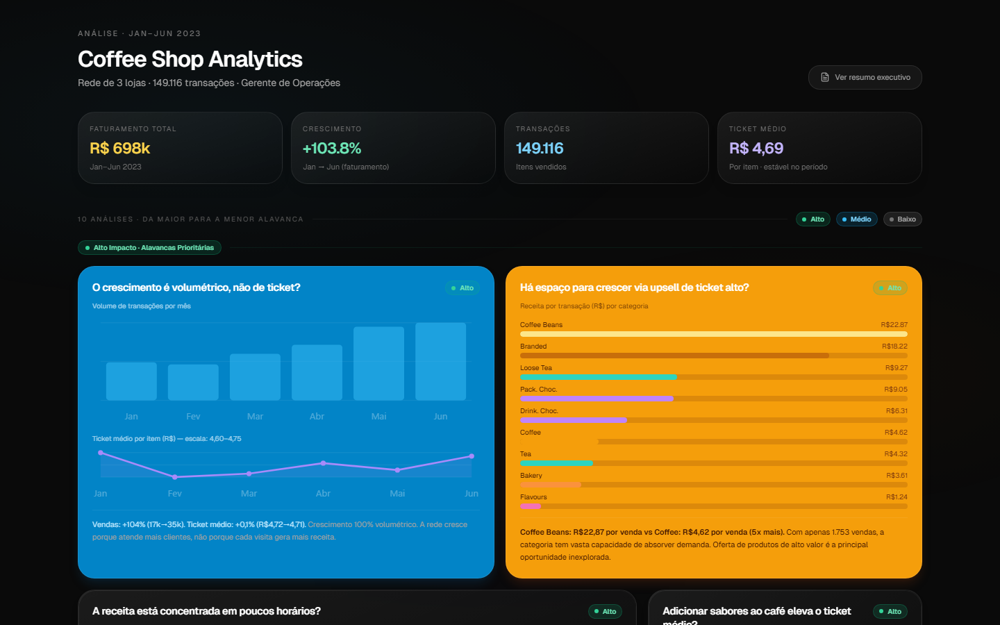

# ☕ Coffee Shop Analytics — de "a receita cresceu" a "por que ela cresceu"

Dashboard analítico estático para uma rede de 3 cafeterias, construído para testar 11 hipóteses de negócio e identificar as alavancas de receita ainda não exploradas no primeiro semestre de 2023.


🔗 **Dashboard em produção:** https://guigrandim.github.io/coffe_shopping/

<p align="center">

</p>

<p align="center">

</p>

### 🎯 Destaques
- Testei 11 hipóteses de negócio sobre 149.116 transações reais e identifiquei que **100% do crescimento de +103,8% na receita é volumétrico** — o ticket médio nunca se moveu, expondo uma alavanca de upsell inexplorada.
- Encontrei uma correlação de **r = 0,74** entre personalização de sabor (syrups) e ticket médio por hora, virando a base de uma recomendação operacional de baixo custo e alto ROI.
- Entreguei um dashboard estático (HTML + TailwindCSS + SVG inline), sem backend nem build step, publicado via GitHub Pages e pronto para ser aberto por qualquer gestor sem instalar nada.

---

## 🚨 Problema de Negócio

Uma rede de 3 cafeterias (Astoria, Hell's Kitchen e Lower Manhattan) encerrou o primeiro semestre de 2023 com crescimento expressivo de faturamento. A gestão, no entanto, não sabia **por que** a receita cresceu — se foi aumento de clientes, aumento do ticket médio por visita, melhora de mix de produtos ou concentração em poucas lojas — e tampouco conhecia as **alavancas ainda não exploradas** que poderiam ampliar esse resultado.

Sem clareza sobre a origem do crescimento, decisões de expansão, escalonamento de equipe e estratégias de venda corriam o risco de se apoiar em premissas erradas.

**Pergunta central:** Onde estão as maiores oportunidades de receita que a rede ainda não está capturando?

**Minha tarefa:** Conduzir a análise exploratória completa do dataset transacional, formular e testar as hipóteses de negócio mais relevantes, e traduzir os achados em um dashboard e resumo executivo prontos para orientar decisão de gestão.

---

## 🗺️ Planejamento da Solução

A solução foi estruturada em 4 etapas:

1. **Entendimento dos dados** — análise exploratória do dataset transacional (149.116 linhas), mapeamento do schema, identificação de formatação (moeda em BRL com vírgula decimal, datas DD-MM-YYYY) e limpeza dos dados antes da análise.

2. **Formulação de hipóteses** — 11 hipóteses de negócio ordenadas da maior para a menor alavanca potencial, cobrindo crescimento, concentração horária, mix de produtos, comportamento por loja, padrões temporais e análise de cohort simulada.

3. **Teste das hipóteses** — cada hipótese foi testada com os dados reais: análise descritiva, correlações, decomposição de receita por dimensão (hora, loja, categoria, mês) e cálculo de impacto financeiro estimado.

4. **Visualização e síntese** — dashboard interativo em HTML estático com 11 cards analíticos (`docs/index.html`) e resumo executivo com recomendações priorizadas (`docs/resumo_executivo.html`).

**Ferramentas:** Python (pandas, numpy), Jupyter, HTML, TailwindCSS, SVG inline para gráficos, Lucide Icons, Google Fonts (Geist, Plus Jakarta Sans).

---

## 🛠️ Desenvolvimento

### Dataset

| Atributo | Detalhe |
|---|---|
| Arquivo | `assets/data/coffee-shop-dataset.csv` |
| Período | Janeiro a Junho de 2023 |
| Volume | 149.116 transações |
| Lojas | Astoria (id 3), Hell's Kitchen (id 8), Lower Manhattan (id 5) |
| Moeda | Real Brasileiro (R$) — formato `"R$ 45,00"` |
| Granularidade | Item por item (cada linha = 1 produto vendido) |

### Visualizações Desenvolvidas

- Gráfico de barras mensais (crescimento volumétrico)
- Dual-line chart sobrepostos (ticket médio vs. volume)
- Gráfico de barras horizontais (ranking de ticket por categoria)
- Histograma de receita por hora (concentração horária)
- Área chart com correlação syrups/ticket
- Stacked bar de participação de lojas por mês
- Tabela de performance por loja com crescimento
- Gráfico de linha por dia da semana (fins de semana vs. úteis)
- Heatmap de cohort simulada: 9 categorias × 6 meses, receita indexada a Jan=100

### Estrutura do Projeto

```
coffee_shop/
├── assets/
│   ├── data/
│   │   ├── coffee-shop-dataset.csv   # 149.116 transações, Jan–Jun 2023
│   │   └── hypothesis_data.json      # agregados usados pelo dashboard
│   └── img/                          # screenshots e gráficos exportados
├── docs/
│   ├── index.html                    # Dashboard principal (11 hipóteses)
│   ├── resumo_executivo.html         # Resumo executivo para gestão
│   └── assets/                       # CSS, fontes e bibliotecas JS bundladas
├── notebooks/
│   └── analysis.ipynb                # EDA: limpeza, agregações, correlações
├── generate_dashboard.py             # Script auxiliar de geração
└── index.html                        # Redirect raiz → docs/
```

### Como Executar Localmente

O dashboard é estático e não precisa de servidor — basta abrir `docs/index.html` no navegador. Para reproduzir a análise no notebook:

```bash
git clone <repo-url>
cd coffee_shop
pip install -r requirements.txt   # pandas, numpy
jupyter lab notebooks/analysis.ipynb
```

---

## 💡 Top Insights

### 1. 📈 O crescimento é 100% volumétrico — o ticket nunca variou

O faturamento cresceu **+103,8%** de janeiro (R$81.678) a junho (R$166.486), mas o ticket médio permaneceu praticamente estável — variou apenas de **R$4,72 em janeiro** para **R$4,71 em junho** (+0,1%), com média global de R$4,69 no semestre. O crescimento veio inteiramente do aumento no número de transações (+104%: de 17k para 35k por mês).

**Implicação:** A rede dobrou de tamanho sem nenhuma ação de precificação ou upsell. Qualquer melhora no ticket médio representa receita incremental pura — sem precisar atrair um único novo cliente.

---

### 2. ☕ Coffee Beans têm ticket 5× maior que o café e quase ninguém vende

A categoria **Coffee Beans** gera R$22,87 por transação — contra R$4,62 do café comum. Com apenas 1.753 transações no semestre, representa uma fração irrisória do volume total, mas cada venda equivale a 5 cafés.

**Implicação:** Upsell ativo de Coffee Beans e Branded (R$18,22/txn) no momento do pedido é a alavanca de maior retorno imediato: nenhum novo produto, nenhum desconto, sem marketing — apenas script de balcão.

---

### 3. ⏰ 36,7% da receita diária está comprimida em 3 horas

Os horários das **8h às 10h** concentram mais de 1/3 de toda a receita de um dia de 15h de operação. O pico absoluto é às 10h, consistente nas 3 lojas e em todos os meses — inclusive sábados e domingos, com intensidade idêntica aos dias úteis.

**Implicação:** Qualquer gargalo operacional nessa janela (falta de equipe, equipamento, produto) custa ~12% da receita do dia por hora perdida. Escala de fim de semana precisa ser idêntica à de dias úteis.

---

### 4. 📉 Branded descolou do mercado — a única categoria que caiu em fevereiro

A cohort simulada indexa a receita de cada categoria a Jan=100 e rastreia a trajetória ao longo do semestre. **Branded é o principal outlier negativo**: a maioria das categorias cresceu entre +89% e +114% no semestre — Branded terminou em +81% e colapsou para índice 65 em fevereiro (–35% em relação à base). Coffee Beans (+89%) e Pack. Chocolate (+90%) também ficaram abaixo da média, mas sem a anomalia de fevereiro.

Loose Tea, no outro extremo, chegou a índice 214 em junho (+114%) — o crescimento mais acelerado de qualquer categoria.

A decomposição de receita mostra que **51% da receita de junho é incremental** em relação à base de janeiro: o negócio dobrou demanda sem nenhuma ação rastreável de retenção.

**Implicação:** O underperformance de Branded é um sinal de problema operacional, de posicionamento ou de visibilidade no cardápio — não de demanda de mercado. Investigar o colapso de fevereiro pode revelar uma alavanca de fácil correção com retorno relevante no ticket (Branded: R$18,22/txn, 4× o ticket do café comum).

---

## 📊 Resultados

### Indicadores extraídos dos dados

| KPI | Valor |
|---|---|
| Faturamento total (Jan–Jun 2023) | R$ 698.812 |
| Crescimento do período | +103,8% (Jan → Jun) |
| Total de transações | 149.116 itens |
| Ticket médio por item | R$ 4,69 (estável) |
| Receita diária média — Janeiro | R$ 2.635/dia |
| Receita diária média — Junho | R$ 5.550/dia |
| Crescimento homogêneo entre lojas | +101% a +105% (sem outlier) |
| Participação do café na receita | 39,5% do total |
| Concentração no pico 8h–10h | 36,7% da receita diária |
| Correlação syrups × ticket | r = 0,74 |
| Receita incremental (Jun vs Jan) | 51% acima da base de janeiro |
| Branded — queda em fevereiro | –35% (índice 65 vs base 100) |
| Loose Tea — maior crescimento | +114% no semestre (índice 214) |

### Resultado da Entrega

O que estava disperso em uma planilha transacional de 149 mil linhas virou um dashboard estático de 11 cards e um resumo executivo, publicáveis via GitHub Pages e navegáveis por qualquer gestor sem depender de análise manual repetida a cada pergunta de negócio. As 11 hipóteses formuladas cobrem as perguntas recorrentes de gestão (crescimento, sazonalidade, mix, comportamento por loja) em um único lugar, substituindo o ciclo de "pedir um corte de dados → esperar → repetir" por consulta direta ao dashboard.

---

## ✅ Conclusões

O crescimento da rede é real, sustentado e estruturalmente saudável — todas as 3 lojas crescem na mesma proporção, o que indica um modelo operacional que funciona e pode ser replicado. A análise revelou, porém, que esse crescimento foi 100% volumétrico e que a alavanca de ticket médio permanece intocada — transformando um dado que parecia positivo à primeira vista em uma oportunidade concreta e de baixo custo para a gestão agir.

**Ações prioritárias recomendadas:**

1. 🗣️ **Protocolo de upsell no balcão** — cada +R$0,50 por transação equivale a +R$75k/ano na rede. Treinar o atendente para oferecer Coffee Beans e Branded na finalização do pedido é o mecanismo de maior retorno.

2. 🍬 **Oferta ativa de syrups e flavours** — a correlação r=0,74 entre personalização de sabores e ticket mais alto indica que horas com mais upsell de flavours têm ticket consistentemente maior. Uma pergunta padrão ("Deseja adicionar um sabor?") captura essa receita imediatamente.

3. 👥 **Dimensionamento de equipe das 8h às 10h** — incluindo sábados e domingos com a mesma intensidade dos dias úteis. O custo de subescalar essa janela é desproporcional.

4. 📋 **Formalizar o playbook operacional** — a homogeneidade entre lojas (+101% a +105%) indica que as práticas atuais funcionam. Documentar e formalizar cria a base para treinamento e expansão futura.

5. 🔍 **Investigar o colapso de Branded em fevereiro** — única categoria com queda de –35% em relação à base, crescendo 20 pp abaixo da média do semestre. Avaliar estoque, visibilidade no cardápio e posicionamento. Se corrigida, Branded (R$18,22/txn) tem potencial de recuperação imediata no ticket médio da rede.

**Limitações da análise:** Os dados cobrem apenas 6 meses sem comparativo histórico. Não há identificador de cliente (impossível calcular LTV ou cohort de retenção real); a cohort simulada usa categoria como proxy de coorte, o que é uma aproximação metodológica. Dados de custo não estão disponíveis (análise de margem requer informações adicionais).

---

*📁 Dados: coffee-shop-dataset.csv · 📅 Período: Jan–Jun 2023 · 🏪 3 lojas · 🔢 149.116 transações*

## 🧰 Skills Demonstradas

- **Limpeza de dados não padronizados** — normalização de moeda BRL (`"R$ 45,00"` → float) e datas day-first via pandas.
- **Formulação e teste de hipóteses de negócio** — decomposição de receita por dimensão (hora, loja, categoria, mês) para isolar a causa raiz do crescimento.
- **Análise de correlação aplicada a decisão operacional** — tradução de r = 0,74 em uma recomendação de baixo custo e alto ROI, não apenas um número em um relatório.
- **Construção de dashboard estático sem dependências de backend** — HTML + TailwindCSS + SVG inline, publicável via GitHub Pages sem build step.

## 👩‍💻 Autor

Desenvolvido por Guilherme Grandim como um projeto de portfólio em ciência de dados.
Gmail: gui.grandim@gmail.com

## 📄 Licença

Este projeto está sob a licença MIT — veja [LICENSE](./LICENSE) para detalhes.
